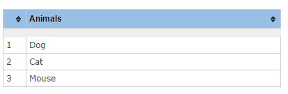

# rowIndex
A table sorter widget to add a dynamic row index to your table.  When the table is sorted it will correctly re-index the rows.


<h3>Requires:</h3>
<ul>
<li>jquery</li>
<li>tablesorter (http://mottie.github.io/tablesorter)</li>
</ul>

<h3>Usage:</h3>
Add it to the table sorter widget list. 
<br/> 
For example, if you are already using the zebra striping widget then it would look like this
<br/>
widgets : ['zebra, rowIndex']
<br/>
Note: If you are using the filter widget you may want to add your own empty header and cell in the table mark up so that the filter widget takes into account the extra column.
E.g. <th class="row-index"></th> and <td class="row-index"></td>.  This widget will see that you have a placeholder header and cell and use it.


<h3>Example:</h3>
<h4>HTML</h4>
```
<table>
	<thead>
		<tr>
			<th>Animals</th>
		</tr>
	</thead>	
	<tbody>
		<tr>
			<td>Dog</td>
		</tr>
		<tr>
			<td>Cat</td>
		</tr>	
		<tr>
			<td>Mouse</td>
		</tr>			
	</tbody>
</table>
```

<h4>Javascript</h4>
```
$(function() {
  // call the tablesorter plugin
  $("table").tablesorter({
    theme: 'blue',
    widgets: ["rowIndex"]
  });
});
```

<h4>CSS</h4>
```
<style>
	table .row-index{
		width: 10px;
	}
</style>
```


